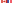

[![Version][version-badge]][version-url]
[![License][license-badge]][gpl]

### Home Assistant Blueprint

Copyright © 2022, Andreas Nixdorf.

This program is free software: you can redistribute it and/or
modify it under the terms of the [GNU General Public License]([gpl] as
published by the Free Software Foundation, either version 3 of
the License, or (at your option) any later version.

This program is distributed in the hope that it will be useful,
but **without any warranty**; without even the implied warranty of
**merchantability** or **fitness for a particular purpose**.  See the GNU
General Public License for more details.

You should have received a copy of the GNU General Public
License along with this program.  If not, see 
<http://www.gnu.org/licenses/>.

This applies to all documents and/or source code files that do not contain a copyright notice to the contrary. At this time, only the **Code of Conduct for Contributors** is published in derogation of the GPLv3 guidelines. Like *Mozilla's Guidelines for Contributing to the Community*, which served as a basis and inspiration, it is published according to the guidelines of the Creative Commons Attribution-ShareAlike license.

### The most important licensing terms in a nutshell

#### Disclaimer of Warranties

There is no warranty for the template, to the extent permitted by applicable law. Except when otherwise stated in writing the copyright holders and/or other parties provide the template **"AS IS"** without warranty of any kind, either expressed or implied, including, but not limited to, the implied warranties of merchantablility and fitness for a particular purpose. The entire risk as to the quality an performance of the template is with you. Should the template prove defective, you assume the cost of all necessary servicing, repair or correction.

#### Limitation of Liability

In no event unless required by applicable law or agreed to in writing will any copyright holder, or any other party who modifies and/or conveys to the template as permitted above, be liable to you for damages, including any general, special, incidental or consequential damages arising out of the use or inability to use the template (including but not limited to loss of data or data being rendered inaccurate or losses sustained by you or third parties or a failure of the template to operate with any other programs), even if such holder or other party has been advised of the possibility of such damages.

#### Interpretation

If the disclaimer of warranty and limitation of liability provided
above cannot be given local legal effect according to their terms,
reviewing courts shall apply local law that most closely
approximates an absolute waiver of all civil liability in
connection with the Program, unless a warranty or assumption of
liability accompanies a copy of the Program in return for a fee.

### Copyrights / Attribution

This repository template is a derivative of a Home Assistant Blueprint.

[Home Assistant Blueprints][project-url] 
Copyright © home-assistant.io 
Distributed with copyright under the [Apache license version 2.0](docs/License.apache.en.md).

[![canada][canada]][ca-url] Flag of Canada 
Copyright © Wikimedia Commons. The current SVG encoding is a rewrite performed by MapGrid. - This vector image is generated programmatically from geometry defined in File:Flag of Canada (construction sheet - leaf geometry). 
Free to use (Public Domain).

[![france][france]][fr-url] Flag of the French Republic 
Copyright © SKopp. 
Free to use (Public Domain).

[![germany][germany]][germany-url] Flag of the Federal Republic of Germany 
Copyright © SKopp, Madden and other users - Own Work. 
Free to use (Public Domain).

[![uk][uk]][uk-url] Flag of the United Kingdom 
Copyright © Acts of Union 1800 Vector: Zscout370 - Own Work, based on: United Kingdom at Flag of the World, United Kingdom Flag at the Flag Institute. 
Free to use (Public Domain).

[![usa][usa]][usa-url] Flag of the United States of America 
Copyright © Dbenbenn, Zscout370, Jacobolus, Indolences, Technion. - SVG implementation of U.S. Code: Title 4, Chapter 1, Section 1 [1] (the United States Federal "Flag Law"). 
Free to use (Public Domain).

[![shields][shields]][shields-url] All used shields and badges 
Copyright © Uptime Robot Service Provider Ltd. as the operator of Shields.io. 
Free to use (Public Domain).

[canada]: docs/images/canada.svg
[france]: docs/images/france.svg
[germany]: docs/images/germany.svg
[uk]: docs/images/uk.svg
[usa]: docs/images/usa.svg

[logo]: images/hassio-icon.png
[project-url]: https://www.home-assistant.io/docs/automation/using_blueprints/

[license-badge]: docs/images/license.svg
[gpl]: LICENSE.en.md
[apache]: docs/License.apache.de.md
[mit]: docs/License.mit.de.md
[my-license]: LICENSE.md

[version-badge]: docs/images/version.svg
[version-url]: https://github.com/nixe64/Home-Assistant-Blueprint/releases

[shields]: docs/images/shields-logo.svg
[shields-url]: https://uptimerobot.com/terms/

[ca-url]: https://commons.wikimedia.org/w/index.php?curid=32276527
[fr-url]: https://commons.wikimedia.org/w/index.php?curid=343059
[germany-url]: https://commons.wikimedia.org/w/index.php?curid=343071
[uk-url]: https://commons.wikimedia.org/w/index.php?curid=347935
[usa-url]: https://commons.wikimedia.org/w/index.php?curid=318418
